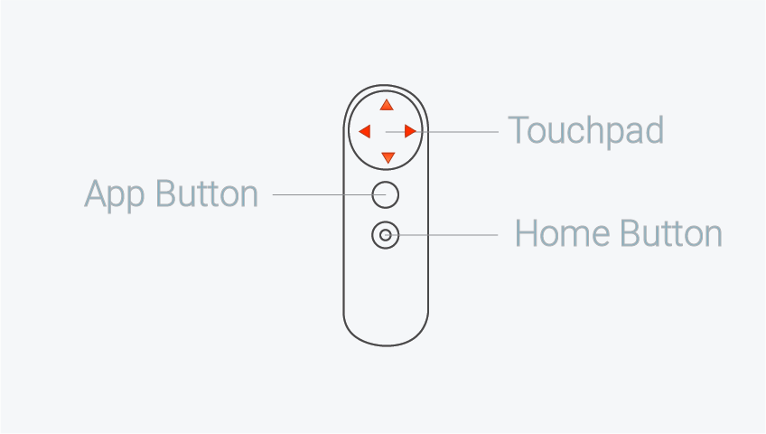

# Google VR Walking Character Controller
## GvrWalkingCharacterController.cs
### By Sam Halperin

This script allows the user to walk around a VR scene
by swiping over the control surface of the GVR remote
as if it were a d-pad.

To get started, see the releases page.

### See also:
* Gvr reference docs:
* https://developers.google.com/vr/reference/unity/class/GvrControllerInput
